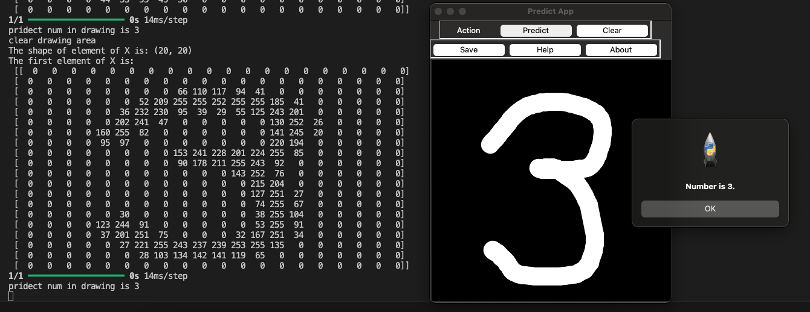
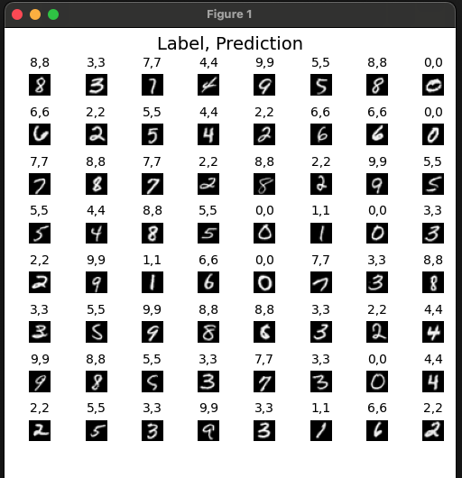

# Number Prediction AI

This project aims to learn digits from 0-9 from 5000 traning data and then create a neural network. Then uses a drawing app to predict the number that is drawn

## Screenshot



## Getting Started

Install dependencies like numpy, tensorflow

with following command
```
pip install <dependencies>
```

Run 
```
python create_model.py
```



then 
```
python load_model.py
```

## Authors

* **Naman Gupta** - *Initial work*

